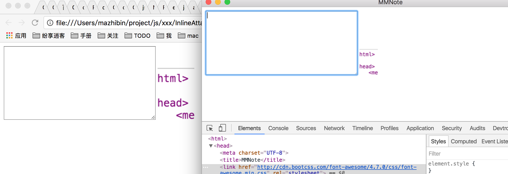

## 值得学习的教程

- [使用 Electron 构建桌面应用 - 前端外刊评论 - 知乎专栏](https://zhuanlan.zhihu.com/p/20225295?columnSlug=FrontendMagazine)

## 值得学习的APP

- [brrd/Abricotine: Markdown editor with inline preview](https://github.com/brrd/Abricotine)
- [Automattic/simplenote-electron: A Simplenote React app packaged in Electron](https://github.com/Automattic/simplenote-electron)
- [AnotherNote/anote: another markdown note (inspired by evernote)](https://github.com/AnotherNote/anote)
- [amitmerchant1990/electron-markdownify: A minimal Markdown editor desktop app based on Electron](https://github.com/amitmerchant1990/electron-markdownify)

## 开发工具

## 打包工具

- [electron/application-distribution.md at master · electron/electron](https://github.com/electron/electron/blob/master/docs/tutorial/application-distribution.md)
- [electron-userland/electron-builder: A complete solution to package and build a ready for distribution Electron app with “auto update” support out of the box](https://github.com/electron-userland/electron-builder)
- [electron-userland/electron-packager: Package and distribute your Electron app with OS-specific bundles (.app, .exe etc) via JS or CLI](https://github.com/electron-userland/electron-packager)

## 开发手记

### 2016年12月22日 React动画
这两天从react-treebeard这个插件看起，了解其中使用到的Radium和velocity-react。因为这个插件在限制宽度的情况下，显示有些问题，所以要么进行修改，要么得自己写一个。

关于**树节点动画**，这个插件在展开节点时，会旋转左侧箭头(svg画的)，同时会动画展开其子列表。这个还不错。我一直以为所有的编辑器都有这个动画的，以为很基础嘛，没想到观察了一下,每个编辑器表现都不一样：

- sublime: 箭头无动画，展开有动画
- vscode: 都无动画
- atom: 都无动画
- TextMate: 箭头无动画，展开有动画

没想到，这两个动画竟然没有做全的。其中，看了vscode和atom的html，其箭头都是使用::before伪元素做到的，所以不支持动画吧。(2016年12月24日 补充：看了下ant design的树控件，使用伪元素，也是能做到动画的)

再说说**在有限空间内，各个编辑器是如何展示的条目**的：

- sublime: 不会压缩显示，可以横向滚动
- vscode: 压缩显示，条目名称最后压缩为省略号
- atom: 不会压缩显示，可以横向滚动
- TextMate: 压缩显示，条目名称中间压缩为省略号

我个人是倾向于不压缩显示的。

### 2016年12月25日 树控件 Webpack自动刷新 区分配置文件
今天早上竟然失眠，6点多就起来了，继续写树控件，现在有点样子了，整合了web font和max-content：


主要是解决了react-treebread空间的小空间换行问题和宽度不对问题。CSS的width是关键，具体参考了：[理解CSS3 max/min-content及fit-content等width值](http://www.zhangxinxu.com/wordpress/2016/05/css3-width-max-contnet-min-content-fit-content/).

我一遍做一边参考atom和vscode（基于HTML5技术就是好啊，随时随地可以参考）。发现atom是常规做法，也就是整个树是一个ol或者ul，然后一个一个递归渲染出。对于没有打开的子目录是不会渲染到DOM上的。

但是vscode却不是。其目录树完全是一个div list。层级关系的表示都是在inline style中设置padding left做到的，应该是在代码中算出来的。而且，最最重要的一点，他没有渲染出整个已经打开的目录树，而是只渲染了但求可见范围内的节点！！！**这是多么机智的优化啊！！！**

这样就算你打开了N多文件的目录，页面也不会卡顿，因为他只渲染当前可以显示的这么十几条数据。学习了。

晚上：
学习了如何使用webpack的开发服务器，以及如何区分配置：

```
"hot-server": "cross-env NODE_ENV=development node --max_old_space_size=2096 -r babel-register server.js",
```

这是electron-react-boilerplate项目的一个npm script。通过cross-env这个包来指定环境变量，区分开发环境还是正式环境，然后在代码中判断该变量走不通配置等：

```
if (process.env.NODE_ENV === 'production') {
  module.exports = require('./configureStore.production'); // eslint-disable-line global-require
} else {
  module.exports = require('./configureStore.development'); // eslint-disable-line global-require
}
```

看了下[Redux 入门教程（三）：React-Redux 的用法 - 阮一峰的网络日志](http://www.ruanyifeng.com/blog/2016/09/redux_tutorial_part_three_react-redux.html)，不是很懂。。。感觉结合Redux还是比较麻烦的，概念比较多。

这两天对整个React应用开发和CSS都加深了认识，但是完全不够啊，还是没有到达能够“开工”的标准。。。


### 2016年12月30-31日 新建工程
占时先不学习Redux了，直接开始写吧，新建工程走起。

```
mkdir mmnote
cd mmnote
npm init

npm install --save-dev webpack typescript awesome-typescript-loader source-map-loader  css-loader style-loader webpack-dev-server less less-loader
npm install --save react react-dom @types/react @types/react-dom lodash electron normalize.css
npm install --save codemirror @types/codemirror react-split-pane @types/react-split-pane

// fs-extra @types/fs-extra
```

//TODO 搭建项目笔记，记录目前搭建的步骤，随着项目不断推进，不断学习后更新。


### 2017年01月01日 星期日 树形控件与真实目录对应
今天雾霾好大，去奥林匹克公园逛了逛。今天争取吧目录树和真是目录对应上。

第一个问题是node.js中如何遍历目录树。

fs-extra这个包是fs包的扩展，其中包括了遍历目录树。

但是呢，依赖这种扩展，对应的ts声明又太久了，现在还懒得学习如何编写声明。还是看看对应的walk是如何实现的吧。

[node-klaw: A Node.js file system walker with a Readable stream interface](https://github.com/jprichardson/node-klaw)

代码很简单，就一个文件，但是涉及的知识点很多。

我学着他的代码写了一个例子：

```
var Readable = require("stream").Readable;
var util = require("util");

function Walker() {
    var options = {
        objectMode: true
    };
    this.result = [];
    Readable.call(this, options);
}

Walker.prototype._read = function() {
    if (this.result.length == 3) {
        return this.push(null);
    }
    this.result.push("hello");
    this.push("hello");
}

util.inherits(Walker, Readable)

var walk = new Walker();
walk.on("data", function(data) {
    console.log(data);
});
walk.on("end", function(data) {
    console.log("end");
    console.log(data);
});
```

这是自定义Readable的最简单的一个例子了。

- 使用nodejs自带的util.inherits()来实现继承
- 继承Readable一定要实现_read()方法，其中使用this.push()来添加这次读取的内容，使用this.push(null)表示读取完毕

至于如何整合到项目中，目前觉得先使用fs.readdir()来实现即可。

ts的interface可以有默认值么？ -- 不能

今日进展：

![]（/img/mmnote-2017-01-02-tree-demo.png)

### 2017年01月02日 星期一 树形控件滚动条样式
看Atom的滚动条样式发现css的选择器中出现了`/deep/`这种写法。

[html5 - What do /deep/ and ::shadow mean in a CSS selector? - Stack Overflow](http://stackoverflow.com/questions/25609678/what-do-deep-and-shadow-mean-in-a-css-selector/25609679#25609679)

看来是为了能够修饰shadow dom内部而生的选择器。

---

滚动条样式目前看来没有同意写法，还好我们只用写webkit的：

[自定义浏览器滚动条的样式，打造属于你的滚动条风格](http://www.lyblog.net/detail/314.html)

修改了滚动条样式的效果：


---

发现树控件中的选中是个麻烦事。点击一个节点，选中当前，但是需要把之前选中的取消选中，如果支持多选，就得用一个数组来保存了。

而且选中后的高亮也是麻烦事。vscode中因为不是数结构所以好做，但是Atom中就不容易了，需要用一个定位为absolute的before伪元素来做到。

---

服了，javascript中竟然没有清空数组的方法。。。see [How do I empty an array in JavaScript? - Stack Overflow](http://stackoverflow.com/questions/1232040/how-do-i-empty-an-array-in-javascript)

---

接着就是引入code-mirror了。

参考项目：[JedWatson/react-codemirror: Codemirror Component for React.js](https://github.com/JedWatson/react-codemirror)

**注意** CodeMirror.fromTextArea()这个方法，会使用textarea中的内容，忽视传入的value参数。

---

遇到一个棘手问题，codemirror和flex布局结合，导致宽度处理不对了。

被搞吐了，一个下午就花在codemirror的linenumber上了，搞不懂新写的例子都没问题。就是这个项目里面的有问题。

表现是这样的：


右边灰色的全是line number。。。先回避这个问题吧。

目前的效果：


乍看还不错😁，但是还很不完美。

---

接下来是想实现快捷键Ctrl+S保存的功能。

学习[使用 Electron 构建桌面应用 - 前端外刊评论 - 知乎专栏](https://zhuanlan.zhihu.com/p/20225295?columnSlug=FrontendMagazine)

其中提到了无标题栏窗口的做法，可以在mac中做出很漂亮的界面：

[Frameless Window - Electron](http://electron.atom.io/docs/api/frameless-window/)

观察了一下，发现atom是包含系统标题栏的，而vscode则是使用了`titleBarStyle: 'hidden'`加上自定义的标题栏实现的。


后者可以让标题栏成为主题可以定制的一部分，明显更好看了。不知道windows底下是如何表现的。

---

ipc原来是通过on和send来交互的，用起来很简单。

被坑了一波。`var ipc = require('ipc');`这种写法是过时的，新的写法是：`const {ipcMain} = require('electron')`

[ipcMain - Electron](http://electron.atom.io/docs/api/ipc-main/)

### 2017年01月04日 星期三 IPC

遇到错误`Cannot find name 'Promise'`，需要把typescript的target改成es1.6

[node.js - error TS2304: Cannot find name 'Promise' - Stack Overflow](http://stackoverflow.com/questions/39116687/error-ts2304-cannot-find-name-promise)


《electron学习笔记》，添加IPC章节。

### 2017年01月07日 星期六 快捷键 命令框架

如何为程序添加快捷键呢（非全局快捷键）？

vscode的快捷键设置格式是：

```
{ "key": "cmd+delete", "command": "deleteAllRight",
                       "when": "editorTextFocus && !editorReadonly" },
```

一个快捷键绑定了一个命令，同时when指定了快捷键生效的前提条件。条件由几个bool变量构成。

而一如既往，Atom的设计更为叹服：

```
'atom-text-editor':
  'ctrl-b': 'typescript:go-to-declaration'

'atom-text-editor[data-grammar="source gfm"]:not([mini])':
  'tab':        'markdown-folder:dwim-toggle'
  'alt-c':      'markdown-folder:cycle'
```

类似css选择器的写法，更加强大。

我发现好几个地方的设计都是如何，Atom的设计更加前卫。可惜代码质量没有大神来监督，导致在性能上败了。同时选型coffeescript也是个白痴选择。

---

上面两个是王牌，最求最高可定制。而普通软件是如何做的呢？

electron本身使用MenuItem中的click属性来定义菜单点击后执行的代码。我看了Abricotine这款笔记软件的实现，他在菜单template中添加了几个自定义字段，比如platform，command。然后在新建菜单之前，处理一遍template，比如检查当前平台，如果不符合，就隐藏一些菜单项。然后把所有的command翻译为对应的click函数，使用其顶级Application类来执行命令。

```
// 处理template中的每个item

// 把command翻译为click函数，委托给sendCommand
// sendCommand的定义是：var sendCommand = abrApp.execCommand.bind(abrApp)
if (item.command) {
    item.click = (function (command, parameters) {
        return function () { sendCommand(command, parameters); };
    })(item.command, item.parameters);
    item.id = item.command;
    delete item.command;
    delete item.parameters;
}

// 对于菜单的状态，还可以根据配置文件来更新
if (item.type === "checkbox" && typeof item.checked === "string") {
    item.checked = getConfig(config, item.checked);
}
```

我觉得这个设计非常值得学习。用命令来组织这些操作，也是所有编辑器的设计，这样用户也可以在命令面板中执行。

---

Abricotine中是如何exec命令的呢？

```
execCommand: function (command, parameters) {
    // 发送命令到当前激活的窗口
    var win = BrowserWindow.getFocusedWindow();
    if (win) {
        // 使用IPC发送命令
        return win.webContents.send("command", command, parameters);
    }
    // if no window, run a command from commands-main.js
    if (commands && commands[command]) {
        commands[command](this, parameters);
    } else {
        console.error("Unknown command '" + command + "'");
    }
}
```

答案是通过IPC发送命令带对应的window来执行。在render进程代码中，定义command列表：

```
var commands = {

    new: function(win, abrDoc, cm) {
        abrDoc.new();
    },

    open: function(win, abrDoc, cm) {
        abrDoc.open();
    },

    ...
}

// 执行命令
execCommand: function (command, parameters) {
    var win = remote.getCurrentWindow(),
        abrDoc = this;
    if (commands && commands[command]) {
        commands[command](win, abrDoc, abrDoc.cm, parameters);
    } else {
        console.error("Unknown command '" + command + "'");
    }
},
```

---

《electron学习笔记》，添加对话框，菜单，快捷键，shell章节。

---

新建《Abricotine是如何整合CodeMirror的》

### 2017年01月08日 星期日 CodeMirror插件机制

昨天知道了Abricotine的那些“特效”是通过CodeMirror插件实现的。今天来了解一下如何写CodeMirror插件。

《CodeMirror使用笔记》添加“扩展CodeMirror”章节

《Abricotine是如何整合CodeMirror的》完善

### 2017年01月14日 星期六 完善项目搭建

《node.js新的包管理器 - yarn》完成。

《使用yeoman创建项目生成器》完成。

### 2017年01月15日 星期日 工作流升级 gulp electron-connect mocha

keyword： 

- 学习vscode debug设置
- 学习mocha/chai，与typescript结合
- 学习gulp，设计工作流整合
- gulp整合webpack+electron-connect
    - watch主进程代码，使用gulp-typescript编译主进程代码，restart electron
    - watch渲染进程代码，使用webpack-stream编译渲染进程代码，reload electron
- gulp生成typescript
    - 生成ts的sourcemap的配置 [floridoo/gulp-sourcemaps: Source map support for Gulp.js](https://github.com/floridoo/gulp-sourcemaps#write-options)
    - 如何使用vscode来调试 [debugging - How to debug a gulp task with VSCode - Stack Overflow](http://stackoverflow.com/questions/37477139/how-to-debug-a-gulp-task-with-vscode)
- gulp test任务
    - 使用gulp-typescript编译render代码，和test代码到test-out中
    - 拷贝test-res到test-out中去
    - 执行测试

了解到的库：
- 使fs等标准库支持promise：[normalize/mz: modernize node.js to current ECMAScript standards](https://github.com/normalize/mz)

学习到的语法：
- ts不支持重载
- interface不支持默认值

### 2017年01月18日 星期三 更新代码结构 main render test

更新了目录结构，代码都放在src下：

```
.
├── src 代码目录
│   ├── common 公用代码
│   ├── main 主进程代码
│   │   ├── res 资源文件
│   │   ├── application.ts
│   │   ├── main.ts 入口文件
│   │   ├── menu.ts
│   │   └── window.ts
│   └── render 渲染进程代码
│       ├── component react组件
│       ├── res 资源文件
│       ├── service
│       ├── util
│       ├── index.less
│       └── index.tsx
├── test 测试代码目录
│   ├── res 测试资源目录
│   └── tree-service.spec.ts 
├── gulpfile.js
├── package.json
├── tsconfig.main.json 主进程用的tsconfig
├── tsconfig.render.json 渲染进程用的tsconfig
├── tsconfig.test.json 测试代码用的tsconfig
├── webpack.config.js
└── yarn.lock
```

项目结构比较复杂了，有三个部分的代码：main，render，test。三个部分各有交集，但是在生成上的规则又有些不一样。

- main：使用gulp-typescript编译main/common的代码，并输出到dist
- render：使用webpack-stream打包render/common的代码，并输出到dist
- test：使用gulp-typescript编译main/render/common的代码，并输出到test-out，执行测试

目前gulp的完美写法为：

```js
const mainCode = ['src/main/**/*.ts*', 'src/common/**/*.ts*'];
const renderCode = ['src/render/**/*.ts*', 'src/common/**/*.ts*'];
const webpackConfig = require('./webpack.config.js');

gulp.task('main', [], function () {
    return gulp.src(mainCode, { base: "./" })
        .pipe(tsMainProject())
        .js.pipe(gulp.dest("dist"));
});

gulp.task('main-w', ['main'], function () {
    gulp.watch(mainCode, ['main']);
});

function webpackTask(watch) {
    return gulp.src('src/render/index.tsx')
        .pipe(webpack(_.merge(webpackConfig, { watch: watch }), null, function (err, stat) {
            console.log("webpack error: ", err);
        }).on('error', function (err) {
            // fix issue https://github.com/shama/webpack-stream/issues/34
            console.log("webpack task error:", err);
            // this.emit('end');
        }))
        .pipe(gulp.dest("./dist"));
}

gulp.task('webpack', function (cb) {
    return webpackTask(false);
});

gulp.task('webpack-w', ['webpack'], function () {
    webpackTask(true);
})

gulp.task('all-w', ['main-w', 'webpack-w'], function () {

});
```

运行`gulp all-w`就能自动监视编译main和render的代码，简直爽。

### 2017年01月19日 星期四 在electron中安装调试插件

参考[chentsulin/electron-react-boilerplate](https://github.com/chentsulin/electron-react-boilerplate)安装一下插件：

- Devtron - Electron官方提供的调试插件 - Install via electron-debug.
- React Developer Tools - React官方提供的调试插件 - Install via electron-devtools-installer.
- Redux DevTools - Redux调试插件 - Install via electron-devtools-installer.

使用[MarshallOfSound/electron-devtools-installer](https://github.com/MarshallOfSound/electron-devtools-installer)在Electron中安装调试插件，代码如下：

```js
function installChromeExtensions() {
  if (process.env.NODE_ENV === constant.env.nodeEnv.development) {
    const installer = require('electron-devtools-installer');

    const extensions = [
      'REACT_DEVELOPER_TOOLS',
      'REDUX_DEVTOOLS'
    ]

    const forceDownload = !!process.env.UPGRADE_EXTENSIONS;

    console.log("start to install debug extensions....");
    return Promise
      .all(extensions.map(name => installer.default(installer[name], forceDownload)))
      .then(() => {
        console.log("install debug extensions finish");
      }).catch((err) => {
        console.log("install debug extensions error:" + err);
      });
  }
}
```

在app ready后调用即可。安装需要翻墙。安装后就不会再安装了，设置`UPGRADE_EXTENSIONS`可以强制更新：

```
$ UPGRADE_EXTENSIONS=1 npm run dev

# For Windows
$ set UPGRADE_EXTENSIONS=1 && npm run dev
```

然后咱

```
npm install --save-dev devtron

require('devtron').install()
```

### 2017年01月23日 星期一 react-redux 

学习react-redux。大致看了redux的代码，代码真心少。但是学习起来却这么不容易。。。。

而且还可以很强大。或许这就是UNIX设计艺术一个很好的例证。

结合调试扩展，真是可以在应用状态中进行时间旅行：

- [redux-devtools](https://github.com/gaearon/redux-devtools)
- [Redux-devTools简单的使用 - 简书](http://www.jianshu.com/p/a2d4c1856560)

但是不得不说，的确很难消化，我现在还是无法用其开始写mmnote。

还有，对于state，每次都要返回一个新的object么？ -- 对的。

### 2017年01月24日 星期二 immutable.js

immutable.js是js中的不可变数据类型库。其实用起来还是很麻烦的，尤其是获取嵌套的属性。

- [Immutable 详解及 React 中实践 · Issue #3 · camsong/blog](https://github.com/camsong/blog/issues/3)
- [How to Build a Todo App Using React, Redux, and Immutable.js](https://www.sitepoint.com/how-to-build-a-todo-app-using-react-redux-and-immutable-js/)

Immutable.js和redux结合有些问题，因为combineReducers针对的是普通Object。

有一个库实现了针对immutable.js的combineReducers：

- [gajus/redux-immutable: redux-immutable is used to create an equivalent function of Redux combineReducers that works with Immutable.js state.](https://github.com/gajus/redux-immutable)

js的世界就是如此，这个库也不过一百来行，有800多start。。。。

- [解读redux工作原理 - dry - SegmentFault](https://segmentfault.com/a/1190000004236064?utm_source=Weibo)

### 2017年01月26日 星期四 异步action 使用没有类型定义的包

redux的middleware有几个选择：

- 标准的做法是使用 Redux Thunk middleware。要引入 redux-thunk 这个专门的库才能使用。我们后面会介绍 middleware 大体上是如何工作的；目前，你只需要知道一个要点：通过使用指定的 middleware，action 创建函数除了返回 action 对象外还可以返回函数。这时，这个 action 创建函数就成为了 thunk。
- redux-promise 或者 redux-promise-middleware 来 dispatch Promise 替代函数。
- redux-observable 来 dispatch Observable。
- redux-saga 中间件来创建更加复杂的异步 action。

- [Netflix JavaScript Talks - RxJS + Redux + React = Amazing! - YouTube](https://www.youtube.com/watch?v=AslncyG8whg&ab_channel=NetflixUIEngineering)

这个水也好深，不想再这个阶段多花时间在上面了，采用最简单原始的`redux-thunk`

`isomorphic-fetch`这个库不错，用起来。

---

对于使用没有类型定义的包，使用`index.d.ts`，然后简单的写：

```
declare module 'redux-devtools-chart-monitor';
declare module 'redux-devtools-diff-monitor';
declare module 'redux-devtools-inspector';
```

然后`/// <reference path="./index.d.ts" />`

2017年01月28日 初一 codemirror 剪贴板图片

```js
(function(mod) {
  if (typeof exports == "object" && typeof module == "object") // CommonJS
    mod(require("../../lib/codemirror"), require("../markdown/markdown"), require("../../addon/mode/overlay"));
  else if (typeof define == "function" && define.amd) // AMD
    define(["../../lib/codemirror", "../markdown/markdown", "../../addon/mode/overlay"], mod);
  else // Plain browser env
    mod(CodeMirror);
})(function(CodeMirror) {
```

除了原始浏览器环境，其他环境中引入gfm mode就会自动引入依赖的markdown mode和overlay插件。

先不弄树控件了，作为一个插件实现吧(?)。

接下来做获取剪贴板图片。


- 这篇文章中CM作者使用change事件处理粘贴文字的做法值得学习 [Paste with indent? · Issue #2120 · codemirror/CodeMirror](https://github.com/codemirror/CodeMirror/issues/2120)

使用change对象的origin==='paste'来处理粘贴的场景。但是粘贴图片不会触发这个事件。

```js
// src/input/input.js
export function handlePaste(e, cm) {
  let pasted = e.clipboardData && e.clipboardData.getData("Text")
  if (pasted) {
    e.preventDefault()
    if (!cm.isReadOnly() && !cm.options.disableInput)
      runInOp(cm, () => applyTextInput(cm, pasted, 0, null, "paste"))
    return true
  }
}
```

CM的默认处理，如果不是文字，是不会有行为的。

图片拖拽上传插件：
- ⭐️[js拖拽粘贴上传与CodeMirror - 小小懒羊羊SF专栏 - SegmentFault](https://segmentfault.com/a/1190000007434697)
- [Rovak/InlineAttachment: Easily paste and upload files/images in plain textareas](https://github.com/Rovak/InlineAttachment)

widget demo值得学习：
- [CodeMirror: Inline Widget Demo](https://codemirror.net/demo/widget.html)

参考上面的文章知道了做法：

```js
myCodeMirror.on('paste',function(instance, e){
    console.log('paste',instance,e);
    e.preventDefault();
});

e.clipboardData.items[0].getAsFile()
// => Blob {size: 12312, type: "image/png"}
```

如何保存Blob到文件中？

- [blob-to-buffer](https://www.npmjs.com/package/blob-to-buffer)

使用这个库把blob转为buffer即可。

同时发现了依赖这个库的一个很有意思的项目：

- [blob-to-buffer](https://www.npmjs.com/package/blob-to-buffer)

基于CM的markdown编辑器，做得很不错，很多地方都在用：
- ⭐️[NextStepWebs/simplemde-markdown-editor: A simple, beautiful, and embeddable JavaScript Markdown editor. Delightful editing for beginners and experts alike. Features built-in autosaving and spell checking.](https://github.com/NextStepWebs/simplemde-markdown-editor)

---

可以从剪贴板保存图片到本地了，但是图片清晰度不够，这里有一个类似的问题：

- [Javascript: How do I access Hi-DPI/Retina image from the clipboard on a paste event? - Stack Overflow](http://stackoverflow.com/questions/22135549/javascript-how-do-i-access-hi-dpi-retina-image-from-the-clipboard-on-a-paste-ev)

但是没有回答。我看了github的markdown编辑控件，上传的图片是高清的。。。如何做到。

要被整疯了。。。



### 2017年01月29日 星期日

- [Chrome 54 update by groundwater · Pull Request #7909 · electron/electron](https://github.com/electron/electron/pull/7909)
- [355477 - Pasting images doesn't preserve original resolution - chromium - Monorail](https://bugs.chromium.org/p/chromium/issues/detail?id=355477)

这个人问的问题一模一样。难道这个问题这么多年了没人管？？？

现在我用的浏览器是55，而electron使用的是53。下载一个53的chrome看看。

老版本网址：
- [Google Chrome old versions - Mac](http://google-chrome.en.uptodown.com/mac/old)
- [Google Chrome 56.0.2924.76-历史 -FileHippo.com](http://filehippo.com/zh/mac/download_google_chrome_for_mac/history)

关闭自动更新：
- [How to install a previous version of Chrome in Mac / Advanced Questions / Knowledge Base - Imonggo Support](http://support.imonggo.com/help/kb/advance-questions/how-to-install-a-previous-version-of-chrome-in-mac)
- [How to Stop Google Chrome from Auto-Updates for Mac / Advanced Questions / Knowledge Base - Imonggo Support](http://support.imonggo.com/help/kb/advance-questions/how-to-stop-google-chrome-from-auto-updates-for-mac)

```
defaults read com.google.Keystone.Agent checkInterval // => 18000

关闭：
defaults write com.google.Keystone.Agent checkInterval 0
```

控制台中检查版本：

```
navigator.appVersion
```

实验网址：http://jsfiddle.net/zd5pX/44/

```html
<div>Click this pane, and paste</div>

```

```js
$('html').bind('paste', function(e) {
    e.preventDefault();
    var item = (e.clipboardData || e.originalEvent.clipboardData).items[0];
    var type = item.type.split('/').shift();
    if (type == "image"){
        var file = item.getAsFile();
        var blob = URL.createObjectURL(file); // Blob
        document.getElementById('img').src = blob;
    }
});
```

结论：55版本中才修复。electron下个版本为1.5.0，使用的chrome版本为54。。。。等吧。

### 2017年02月03日 星期五 粘贴图片

完成粘贴图片！目前使用的是inline widget，之后再优化别的形式。


下一步是实时预览。然后是图片可以删除。

### 2017年02月05日 星期日 

学习Abricotine，使用`is-url`来判断字符串是否是url

当前问题：markText后，光标有些问题

### 2017年02月08日 星期三

> 问题：markText后，光标有些问题

解决：

```js
let element = document.createElement('img');
element.src = 'file://' + link;

let marker = doc.markText(from, to, {
    replacedWith: element,
    handleMouseEvents: true
});

element.addEventListener("load", function () {
    marker.changed();
});
```

需要调用`marker.changed()`，这样CM会更具当前marker的大小来更新编辑器以及光标。

- [Typing Destructured Object Parameters in TypeScript | Marius Schulz](https://blog.mariusschulz.com/2015/11/13/typing-destructured-object-parameters-in-typescript)

当前任务：[task-11]错误的图片逻辑：
1. 标红
2. 编辑过程中如果不在满足图片语法，则退化为普通文本
3. 编辑过程中如果图片合法了，则渲染为图片

### 2017年02月09日 星期四 列表补全 标题大小区分
使用img的error事件完成错误处理的需求[task-11]。

下一步任务：完善编辑体验（学习SimpleMDE）

1. [task-12-✅]列表等回车会自动补全前缀 
2. [task-13]代码块背景色
3. [task-14-✅]不同级别的标题大小不一样 
4. [task-15]图片被选中时，变色
5. 学习如何编写codemirror mode
6. [task-16]图片宽度最大为编辑器宽度

**[task-12]:**

`addon/edit/continuelist.js`,这个插件添加了`newlineAndIndentContinueMarkdownList`命令，将他绑定到Enter上即可。

```js
var editor = CodeMirror.fromTextArea(document.getElementById("code"), {
    mode: 'gfm',
    lineNumbers: true,
    theme: "default",
    extraKeys: {"Enter": "newlineAndIndentContinueMarkdownList"}
});
```

**[task-14]：**

在css中添加`.CodeMirror .CodeMirror-code .cm-header-1~4`的样式即可：

```css
.CodeMirror .CodeMirror-code .cm-header-1 {
    font-size: 200%;
    line-height: 200%;
}

.CodeMirror .CodeMirror-code .cm-header-2 {
    font-size: 160%;
    line-height: 160%;
}

.CodeMirror .CodeMirror-code .cm-header-3 {
    font-size: 125%;
    line-height: 125%;
}

.CodeMirror .CodeMirror-code .cm-header-4 {
    font-size: 110%;
    line-height: 110%;
}
```

### 2017年02月10日 星期六 打包 编辑器卡顿排查

`beforeSelectionChange`事件，会在选区变化时，但是生效前触发，返回的对象包含：{ranges, origin, update}，可以调用update方法来更新选区。

完成文章：[打包Electron应用 | 木杉的博客](http://mushanshitiancai.github.io/2017/02/11/js/electron/%E6%89%93%E5%8C%85Electron%E5%BA%94%E7%94%A8/)

目前支持粘贴/预览图片的最新DEMO：


大致的架构图：


下一步任务：

1. [task-17-❌]更新文档的state结构，在编辑器编辑时，不更新state（如果更新会导致效率低下）。只在save时更新state。

Editor现在传入的props是一个url，这个不太不和目前的逻辑了。目前使用了CM的Doc，所以一个editor其实承载了多个doc，只是同时只显示当前doc。

=> 发现如果在编辑器更新时不更新state，那么就不是react+redux的模式了，写起来无从下手。。。参考了[JedWatson/react-codemirror](https://github.com/JedWatson/react-codemirror)，发现他的更新模式和我之前写的一样，先onChange，然后更新props后再比较value，这样看起来真的是非常低效啊。但是他的demo并没有出现卡顿的现象。

经过排查，发现如果关闭Redux的DevTools中间件，卡顿就消失了。看来是因为输入时频繁更新state，导致devtool出现瓶颈（人家毕竟是提供时间旅行的。。。）

### 2017年02月12日 星期日 了解Draft.js File URI state思考

- [Draft.js | Rich Text Editor Framework for React](https://facebook.github.io/draft-js/)

这是simplenote使用的编辑器控件，是Facebook推出的一个原生支持React的编辑器。

1. [task-18-✅]Draft.js是如何接受外部指令的？比如replace？

---

为了所谓之扩展性，所有的笔记路径使用uri格式

- [file URI scheme - Wikipedia](https://en.wikipedia.org/wiki/File_URI_scheme#cite_note-2)
- [File URIs in Windows – IEBlog](https://blogs.msdn.microsoft.com/ie/2006/12/06/file-uris-in-windows/)

工具：
- [medialize/URI.js: Javascript URL mutation library](https://github.com/medialize/URI.js)

我需要的能力：

1. 判断协议
2. 如果是file，获取对应的本地path（[TooTallNate/file-uri-to-path: Convert a file: URI to a file path](https://github.com/TooTallNate/file-uri-to-path)）
3. 本地path变为file uri（[file-url](https://www.npmjs.com/package/file-url)）

```
yarn add urijs file-uri-to-path file-url
yarn add @types/urijs @types/file-url
```

```ts
declare module 'file-uri-to-path' {
    function uri2path(uri: string): string;
    export = uri2path;
}
```

---

现在state的定义和使用都非常的不方便！😤

因为使用了immutable.js，导致获取和更新都非常的不方便，获取必须使用get，类型定义完全无效了，而且嵌套的还得使用get(['a','b']),简直恶心到逆天，而且state更新还必须从顶级往下更新才行。

参考了draft.js和simplenote，有了几点结论：

1. 状态的维护比较恶心是不可避免的，因为draft.js中，更新EditorState也不简单，都是从EditorState这个顶级state开始更新其中的子state的，使用set或者put，或者util。。。
2. 获取状态可以使用自定义的方法来获取，其中包装immutable的get，这样不会恶心到外面去，但是重复代码量很多。。。。
3. draft.js比较豪华，所有子状态，只要不是简单类型的，都是自定义Record或者自定义其他数据结构，样板代码量很大。
4. state尽量扁平化吧，会不那么恶心一点，比如simplenote基本只有一层
5. simplenote把远端服务的Bucket直接放到state中去，这样做好吗？

### 2017年02月13日 星期一 

继续纠结redux的state的问题。

- [State 范式化 | Redux 中文文档 Join the chat at https://gitter.im/camsong/redux-in-chinese](http://cn.redux.js.org/docs/recipes/reducers/NormalizingStateShape.html)

> 上面的数据结构比较复杂，并且有部分数据是重复的。这里还存在一些让人关心的问题：
> 1. 当数据在多处冗余后，需要更新时，很难保证所有的数据都进行更新。
> 2. 嵌套的数据意味着 reducer 逻辑嵌套更多、复杂度更高。尤其是在打算更新深层嵌套数据时。
> 3. 不可变的数据在更新时需要状态树的祖先数据进行复制和更新，并且新的对象引用会导致与之 connect 的所有 UI 组件都重复 render。尽管要显示的数据没有发生任何改变，对深层嵌套的数据对象进行更新也会强制完全无关的 UI 组件重复 render
> 正因为如此，在 Redux Store 中管理关系数据或嵌套数据的推荐做法是将这一部分视为**数据库**，并且将数据按范式化存储。

- [不可变更新模式 | Redux 中文文档 Join the chat at https://gitter.im/camsong/redux-in-chinese](http://cn.redux.js.org/docs/recipes/reducers/ImmutableUpdatePatterns.html)

> 正确方法：复制嵌套数据的所有层级

> 不幸的是，正确地使用不变的更新去深度嵌套状态的过程很容易变得冗长难读。 更新 ate.first.second[someId].fourth 的示例大概如下所示：

    ```
    function updateVeryNestedField(state, action) {
        return {
            ....state,
            first : {
                ...state.first,
                second : {
                    ...state.first.second,
                    [action.someId] : {
                        ...state.first.second[action.someId],
                        fourth : action.someValue
                    }
                }
            }
        }
    }
    ```

> 显然，每一层嵌套使得阅读更加困难，并给了更多犯错的机会。这是其中一个原因，鼓励你保持状态扁平，尽可能构建 reducer。

简直是灾难。。。。

immutable的Cursor用起来：

```js
var Cursor = require('immutable/contrib/cursor');
```

- [Immutable 详解及 React 中实践 - pure render - SegmentFault](https://segmentfault.com/a/1190000003910357)

### 2017年02月18日 星期六 tree-view结合Redux 软链接处理 fs-promise

Redux 官方 [Tree View](https://github.com/reactjs/redux/tree/master/examples/tree-view) 示例:

```
git clone https://github.com/reactjs/redux.git

cd redux/examples/tree-view
npm install
npm start
```

open http://localhost:3000/

> 该示例展示了深层嵌套树状视图的渲染，以及为了方便 reducer 更新，state 的标准化写法。优良的渲染表现，来自于容器组件细粒度的、仅针对需要渲染的 tree node 的绑定。

这个例子中，树结构被拉平了。这是redux的state的标准化写法，方便更新。

```js
let tree = {
    0: {
      id: 0,
      counter: 0,
      childIds: [],
      parentId: null
    }
  }
```

---

不同软件对于软链接的处理是如何的呢？


我倾向于vscode，但是软链接的文件夹是不是应该用不同的logo？

---

移入fs-promise后，webpack会报错，参考：

- [Module parse failed: /.../node_modules/any-promise/LICENSE Unexpected token · Issue #27 · kevinbeaty/any-promise](https://github.com/kevinbeaty/any-promise/issues/27)

在webpack配置中添加：

```js
plugins: [
    new webpack.NormalModuleReplacementPlugin(/^any\-promise$/, 'bluebird'),
],
```

### 2017年02月19日 星期日

- [task-19-✅]整合目录树和文档

**[task-19]**

这个整合完，第一阶段就差不多了。现在有几点体会：

1. React+Redux这一套很强，但是我作为从OO这个体系过来的，脑子还是没有完全转过弯来，对于不是“组件.操作(数据)”这种模式还是不适用，老想着直接操作组件。
2. React+Redux这一套很强，但是使用起来不是很简单，组件的编写还好，但是状态这一块简直不能再恶心了。。。虽然用上Immutable后，拼装新的state返回这个不那么乱了，但是读取和更新状态，真心麻烦。。。而且类型系统扑街


为了尽快吧这个项目写出来，最近有些焦虑症了，影响随眠的级别。。。真担心胃炎因此又犯了。


### 2017年02月20日 星期一

提示Warning：`Warning: a promise was created in a handler but was not returned from it`

参考：[Warning Explanations | bluebird](http://bluebirdjs.com/docs/warning-explanations.html#warning-a-promise-was-created-in-a-handler-but-was-not-returned-from-it)

例子：

```js
fsp.stat(path).then(stats => {
    if (stats.isFile()) {
        dispatch(openFileAction(path));
    } else if (stats.isDirectory()) {
        dispatch(openFolderAction(path));
    }
    return null;  // <-- 后面有catch或者then必须加，不然就警告了
}).catch(sendFailAction(dispatch, ACT_OPEN_FAIL));
```

- [task-20]图片和文字在同一行时，编辑文字不正常

### 2017年02月22日 星期三

查Immutable.js的用起来痛苦的资料，到了vue.js，发现了提到了MobX，了解了一下，原来是React上新的状态管理框架。查了下，都说比Redux好写很多，大致了解一下，感觉不错。

- [对比其他框架 - vue.js](http://cn.vuejs.org/v2/guide/comparison.html#MobX) 
- [Tutorials, videos and blogs | MobX](https://mobx.js.org/faq/blogs.html)

### 2017年02月26日 星期日 初步整合kityminder 学习mobx


看完了mobx教程，牛逼，这样就实现了自动更新了，写起来绝对比redux这种轻松很多。至于状态是可变的，目前看来只是不能时间旅行了。

大致用了一下，爽！最爽的一点是可以直接范围对象属性了，而不是使用immutable哪种恶心的访问方式。这就可以用上typescript的类型优势了。

# TODO 
- [React动画实践](http://www.alloyteam.com/2016/01/react-animation-practice/)
- source-map-support