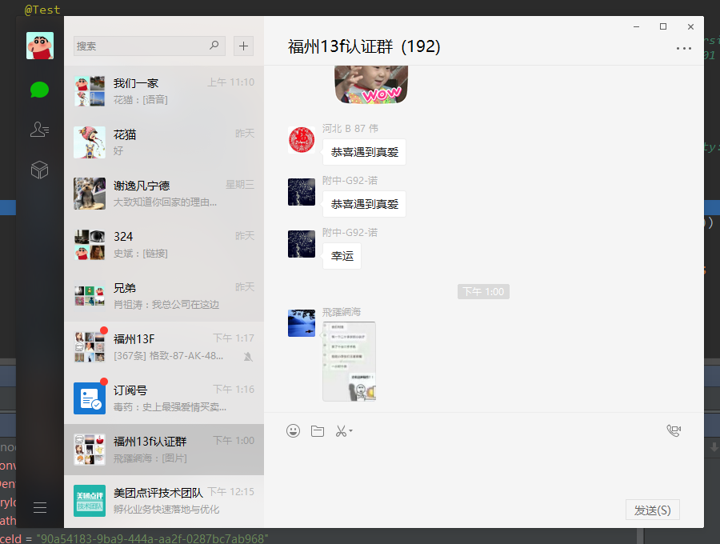

北漂码农一枚。初二接触代码，至今未退烧。工具控。

因为从开始接触代码时，就是随着自己喜欢做啥而做啥，先是跟班里培训Pascal，后来退出后自己研究姐姐从学校带回来的一本C语言书，利用其中提及的Turbo C的图形库来尝试写游戏，几个假期陆陆续续写了些经典小游戏。后大学报计算机科学与技术专业。但是没有潜心底层，依然各个技术都了解一些，但是都不深入，最后混的蛮为失败。所以希望自己可以想精通进发，不求广和新，但求知晓原理。

“要么精通，要么死”

## 我的项目

- [vscode-paste-image](https://github.com/mushanshitiancai/vscode-paste-image)
  vscode插件。粘贴剪贴板中的图片到文本中。
- [vscode-open-iterm2](https://github.com/mushanshitiancai/vscode-open-iterm2)
  vscode插件。快速打开iTerm2。

## 我的目标

2016年：
- 转型Java -> 成功
- 实现自己的笔记软件并在MAS上架 -> 花了一个多月学习swift，放弃。随后研究electron+react，目前进度10% -> 2017年6月23日 放弃

2017年：

技术：

- 阅读Spring源码
  - 2017年6月23日 工作中学会使用UML，流程图分析代码后，尝试使用在阅读Spring代码，发现变得轻松一些，现在有一两篇从边边角角切入的文章。
  - 2017年5月23日 [Spring笔记-Spring如何实现零配置启动](http://mushanshitiancai.github.io/2017/05/23/java/spring/Spring%E7%AC%94%E8%AE%B0-Spring%E5%A6%82%E4%BD%95%E5%AE%9E%E7%8E%B0%E9%9B%B6%E9%85%8D%E7%BD%AE%E5%90%AF%E5%8A%A8/)
  - 2017年6月07日 [Spring笔记-Spring配置](http://mushanshitiancai.github.io/2017/06/07/java/spring/Spring%E7%AC%94%E8%AE%B0-Spring%E9%85%8D%E7%BD%AE/)
  - 2017年6月09日 [Spring笔记-Spring Security学习](http://mushanshitiancai.github.io/2017/06/09/java/spring/Spring%E7%AC%94%E8%AE%B0-Spring-Security%E5%AD%A6%E4%B9%A0/)
  - 2017年6月14日 [Spring笔记-文件上传](http://mushanshitiancai.github.io/2017/06/14/java/spring/Spring%E7%AC%94%E8%AE%B0-%E6%96%87%E4%BB%B6%E4%B8%8A%E4%BC%A0/)
  - 2017年6月17日 [Spring学习-ContextLoaderListener启动流程](http://mushanshitiancai.github.io/2017/06/17/java/spring/Spring%E5%AD%A6%E4%B9%A0-ContextLoaderListener%E5%90%AF%E5%8A%A8%E6%B5%81%E7%A8%8B/)
- 学习MongoDB调优
  - 2017年6月23日 现在接触的业务的数据量是亿级别的，希望可以学到一些大数据下的数据库调优技巧
- 推广博客
  - 2017年6月28日 虽然现在博客还比较水，但是也想被更多的人看到用到。但是因为是在github上托管，基本没有流量，得想想办法导入点流量进来
- 坚持维护目前开源的两个vscode插件
  - 2017年7月4日 我的两个缺点 1. 做出功能了就不想再碰那个代码了 2. 拖延症。导致虽然有人提issue和mr我都懒得管，一拖就是半年了。。。趁这次全部更新一下。以小见大，这么简单的插件都有这么多事儿，一个大的开源项目维护起来是多么需要毅力。
- 完成MMNoote初版。
  - 2017年9月4日 大学就想做的一款笔记软件。考虑，折腾，最初想基于atom，vscode，idea社区版来二次开发，都中途放弃，后使用AngularJs2，React等技术栈，觉得过于复杂，尤其是Webppack+React+Redux+...，简直可怕，中途放弃。最后觉得自己太执着于使用这些时髦技术了，其实也没错，只是自己hold不住，而且这些大框架也不适合我这种小软件使用。于是返璞归真，使用js+jquery，哈哈，且看能否半途而废。
- 编写groovy系列博客
  - 

生活：

- 坚持健身
  - 2017年6月23日 回福州后，从5月中旬开始健身，到现在已经有一个多月了，初有成效，希望能坚持下去
  - 2017年9月4日 健身3个月，虽然最近因为加班和一起健身的同学公司搬走了的原因去的少了些，但是依然坚持，给自己点个赞。目前体重在58/59间徘徊，只是肚子没减下去，当初这个可是我去健身的主要原因啊。。
- 学车
  - 2017年6月23日 大学没舍得向家里要钱学，现在慢慢学吧

## 最 

- 最喜欢的操作系统：macOS
- 最喜欢的语言：Java
- 最喜欢的IDE：JetBrains系列IDE

